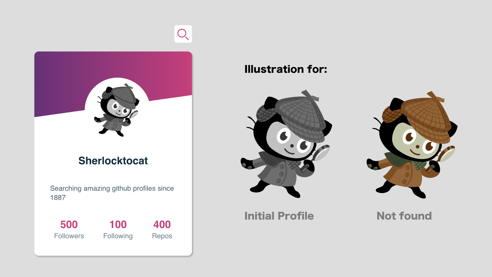
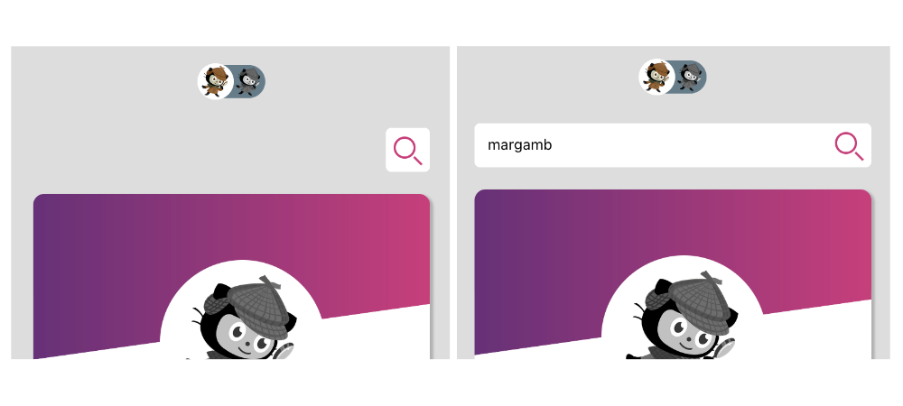
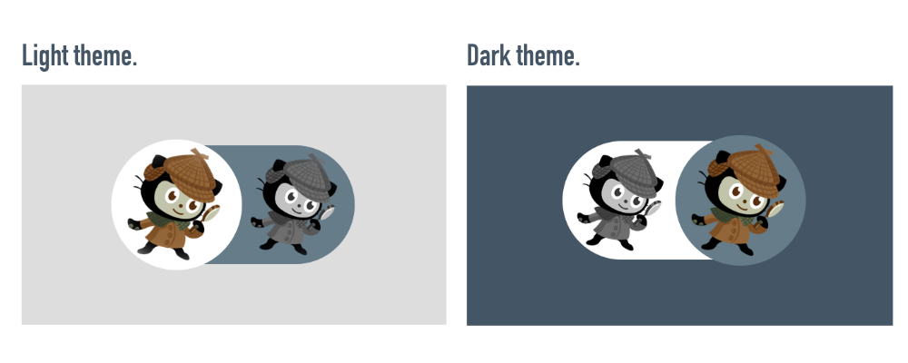

# Sherlocktocat App

A Sherlocktocar app I create to improve my react and javascript. I wonted to learn about fetch and I choosed the API of github and I enjoyed doing a reusable component with its own illustrations.

This app have an animation input  and a reusable profile component. You can search a github profile and see the information on the profile card. The idea was created a reusable component and improve my fetch calls

### State of component

There are three states: Initial, not found and result is ok.

To do that I created two different illustration to show that. 

- **Initial component**: I did a Sherlocktocat object to render the component when the user enter to the web. where star with a 

- **Not found**: I did another object to render when the user enter a github profile name and it doesn't exist (when the status is not 200).

- **Result of the busqueda is ok** and the component shows a github profile.

The input has an animation that grows and shrinks when the user searches for a github user. 

I did a checkbox reusable component to change the theme of the app.

The Sherlocktocat ilustration was created using a pencil 👩🏻‍🎨 and inked with Affinity Designer.

### Color 

I always start designing in black and white. It's the best option to get a sense of balance and rhythm in a design. Then I make a color palette depending on the target.

